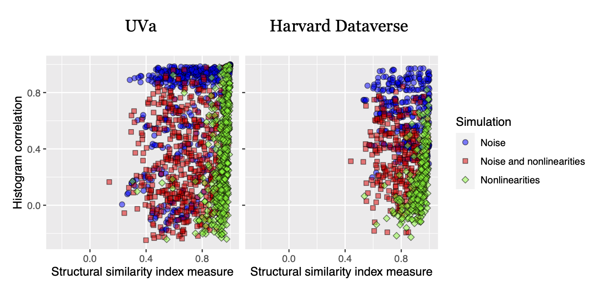

# Histograms

Nicholas J. Tustison, Talissa A. Altes, Kun Qing, Mu He, G. Wilson Miller, Brian B. Avants, Yun M. Shim, James C. Gee, John P. Mugler III, and Jaime F. Mata.  Image- vs. histogram-based considerations in semantic segmentation of pulmonary hyperpolarized gas images. _Magnetic Resonance in Medicine_, 86(5):2822-2836, Nov 2021. [(pubmed)](https://pubmed.ncbi.nlm.nih.gov/34227163/)




Multi-site: (left) University of Virginia (UVa) and (right) Harvard Dataverse 129Xe data. Image-based SSIM vs. histogram-based Pearson’s correlation differences under distortions induced by the common MR artefacts of noise and intensity nonlinearities. For the nonlinearity-only simulations, the images maintain their structural integrity as the SSIM values remain close to 1. This is in contrast to the corresponding range in histogram similarity which is much larger. The effects with simulated Gaussian noise are similar where the range in histogram differences with simulated noise is much greater than the range in SSIM. Both sets of observations are evidence of the lack of robustness to distortions in the histogram domain in comparison with the original image domain.

## Organization

```
Histograms
├── Analysis
│   ├── Data
│   │   ├── He2019_Dataverse
│   │   ├── Nifti
│   │   ├── STAPLE
│   │   ├── SimulationExperiments_Noise
│   │   ├── SimulationExperiments_NoiseAndNonlinearities
│   │   ├── SimulationExperiments_NoiseAndNonlinearities_NoN4
│   │   ├── SimulationExperiments_Noise_NoN4
│   │   ├── SimulationExperiments_Nonlinearities
│   │   └── SimulationExperiments_Nonlinearities_NoN4
│   └── Scripts
├── ElBichoTraining
├── Misc
├── Papers
│   ├── EarlyHyperpolarizedImaging
│   ├── IntensityStandardizationMRI
│   └── QuantifyingFunctionalLungImaging
└── Text
    ├── Figures
    │   └── FeatureMaps
    ├── FiguresDataverse
    ├── Revisions
    ├── Round1
    └── Round2
```
